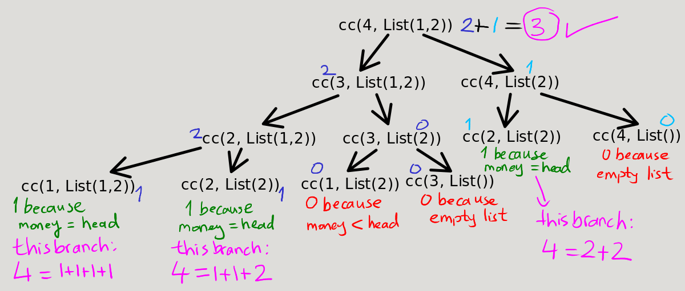

# Hint for `countChange`



# Recursion

In this assignment, you will work with a functional representation of sets based on the mathematical notion of characteristic functions. The goal is to gain practice with higher-order functions.

[Download the recfun.zip](https://moocs.scala-lang.org/~dockermoocs/handouts/scala-3/recfun.zip) handout archive file and extract it somewhere on your machine.

This assignment counts towards your final grade. Please refer to the Grading Policy for more details.

Do not forget to submit your work using the submit task from SBT. Please refer to the example assignment for instructions.

# Exercise 1: Pascal's Triangle

The following pattern of numbers is called *Pascal's triangle*.

​      1   

​    1 1  

  1 2 1 

 1 3 3 1 

1 4 6 4 1   

...

The numbers at the edge of the triangle are all 1, and each number inside the triangle is the sum of the two numbers above it. Write a function that computes the elements of Pascal's triangle by means of a recursive process.

Do this exercise by implementing the pascal function in `RecFun.scala`, which takes a column c and a row r, counting from 0 and returns the number at that spot in the triangle. For example, `pascal(0,2)=1`, `pascal(1,2)=2` and `pascal(1,3)=3`.

```scala
def pascal(c: Int, r: Int): Int
```

# Exercise 2: Parentheses Balancing

Write a recursive function which verifies the balancing of parentheses in a string, which we represent as a List[Char] not a String. For example, the function should return true for the following strings:

- (if (zero? x) max (/ 1 x))
- I told him (that it's not (yet) done). (But he wasn't listening)

The function should return false for the following strings:

- :-)
- ())(

The last example shows that it's not enough to verify that a string contains the same number of opening and closing parentheses.

Do this exercise by implementing the balance function in RecFun.scala. Its signature is as follows:

```scala
def balance(chars: List[Char]): Boolean
```

There are three methods on List[Char] that are useful for this exercise:

- `chars.isEmpty`: Boolean returns whether a list is empty
- `chars.head`: Char returns the first element of the list
- `chars.tail`: List[Char] returns the list without the first element

**Hint**: you can define an inner function if you need to pass extra parameters to your function.

**Testing**: You can use the toList method to convert from a String to a List[Char]: e.g. "(just an) example".toList.

# Exercise 3: Counting Change

Write a recursive function that counts how many different ways you can make change for an amount, given a list of coin denominations. For example, there are 3 ways to give change for 4 if you have coins with denomination 1 and 2: 1+1+1+1, 1+1+2, 2+2.

Do this exercise by implementing the `countChange` function in `RecFun.scala`. This function takes an amount to change, and a list of unique denominations for the coins. Its signature is as follows:

```scala
def countChange(money: Int, coins: List[Int]): Int
```

Once again, you can make use of functions `isEmpty`, `head` and `tail` on the list of integers coins.

**Hint**: Think of the degenerate cases. How many ways can you give change for 0 dollars? How many ways can you give change for >0 dollars, if you have no coins?